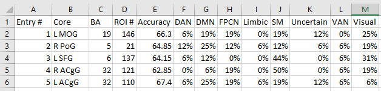
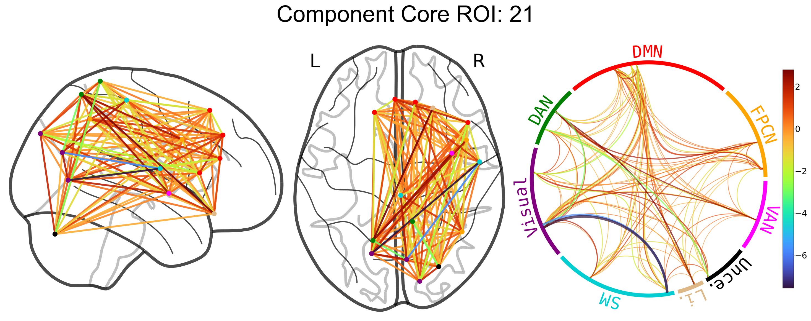
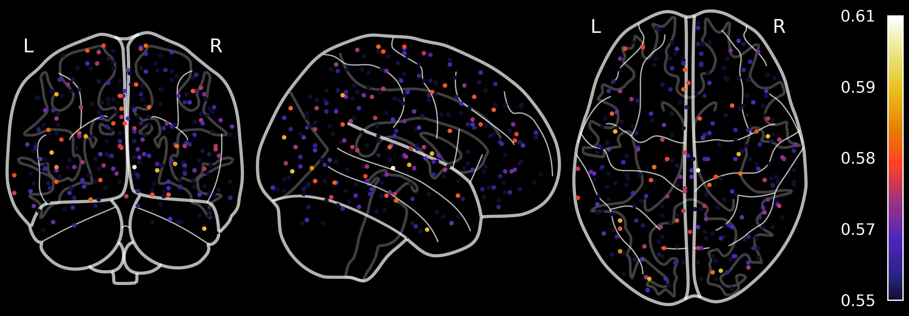

## ConnSearch

`connsearch` is a Python package for analysis of functional connectivity data. 
It is premised on dividing the connectome into network components and fitting an
independent model for each component. ConnSearch is described in the following
paper: 

Bogdan, P.C., Iordan, A. D., Shobrook, J., & Dolcos, F. (2023). ConnSearch: A 
Framework for Functional Connectivity Analysis Designed for Interpretability 
and Effectiveness at Limited Sample Sizes. *NeuroImage*, 120274.

The code to reproduce the results in said paper is in [this repo](https://github.com/paulcbogdan/ConnSearch).
It uses much of the same ConnSearch code as here, but the code here is organized
a bit more nicely to serve as a package. 

<p align="center">
  
</p>

## Installation

`pip install connsearch`

If you are installing from a fresh environment, you may find that some other packages' dependencies create 

## Tutorial

The above [repo for reproducing the manuscript results](https://github.com/paulcbogdan/ConnSearch) provides a summary of the overall code structure and the different ways to use it. In contrast, the present README walks through specific pieces of from one of the examples (`example.group_level.py`).
This example is on group-level ConnSearch - i.e., fitting a classifier for each component and assessing the statistical significance of classifier performance using permutation-testing. Subject-specific ConnSearch is not covered in this tutorial, but see the heavily commented code in `example.subject_specific.py`.

### 1. Generate a dataset. 

```python
X, Y, coords = generate_dataset(n_edges_show_effect=100)
```

`X` is a 5D `np.array`, organized as `(subject, session, example, ROI0, ROI1)`.
The first three dimensions correspond to a participant, their two sessions, and their two examples per session. The last two dimensions correspond to the example's connectivity matrix. `X` is initially created by sampling from a unit normal distribution. `Y` is organized as a 3D array, organized as `(subject, session, example)`, with binary labels as values. To give the classifiers some predictors, a value is 1.0 is added to 100 random edges for all examples where `Y=0`. 

### 2. Define the components. 
```python
components = get_components(proximal=False, X=X, comp_size=16)
```

This code defines components based on connectivity 
    strength, as done in the paper, although components can also be defined
    by proximity by setting `proximal=True` and passing ROI coordinates.

### 3. Create the ConnSearcher object

```python
clf = SVC(kernel='linear')
CS = ConnSearcher(X, Y, coords, components, dir_results, n_splits=n_splits,
                      n_repeats=n_repeats, clf=clf, wu_analysis=wu_analysis)
```

The `ConnSearcher` object will be used to fit and the models for each component. `coords` are
    passed for plotting and assigning labels to ROIs. `dir_results` is where
    the results (accuracy of each component classifier) will be saved. For
    classifier fitting and testing, `n_splits` specifies the number of cross-
    validation splits. `n_repeats` specifies the number of cross-validation 
    repeats. `wu_analysis` is a setting that allows implementing the Wu et al.
    (2021; Cerebral Cortex) using the present code, for comparison purposes, 
    given the method's similarity to ConnSearch.

### 4. Thresholding based on permutation-testing

Permutation-testing should have already been completed before actual analysis is
    done (see `example.run_permutations.py`). Here, the code loads the results 
    of prior permutation-testing:

```python
PM = Permutation_Manager(connsearcher=CS, n_perm=n_perm,
                         cache_dir=f'{ROOT_DIR}/example/'
                                   f'permutation_saves')
```

The `Permutation_Manager` object is used to manage the permutations. The 
    cached results retrieved depends on the settings. Several settings are
    passed via the `connsearcher` object argument (e.g., specifies the 
    dataset size). In addition, `n_perm` is the number of 
    permutations previously run.
    `cache_dir` is where the permutation results will be loaded from. 
    `min_perms` is the minimum number of permutations to run before the 
    threshold is determined.


```python
acc2p, p2acc, _ = PM.get_acc_pval_funcs(min_perms=n_perm)
```

The `get_acc_pval_funcs` method returns two 
    functions: `acc2p` converts accuracy to p-value, and `p2acc` converts 
    p-value to accuracy. The third returned value is a list of the accuracies
    of the permutations.


### 5. Running ConnSearch

```python
CS.do_group_level_analysis(acc2p=acc2p, alpha=.05)
```

`acc2p` is the function that converts accuracy to p-value. Components yielding classifiers with significant accuracy (alpha = .05) will be saved to `dir_results`.
Running permutation-testing is not strictly necessary for the code to function. You can instead simply pass a value for `acc_thresh` to `group_level_analysis` instead. For example, if you set `CS.do_group_level_analysis(acc_thresh=0.63)`, all components with over 63% accuracy will be saved. 

### 6. Reporting (tables & plots)

The reporting functions by looking through `dir_results`. Based on the saved component results, you can create tables, like those in the paper.

```python
fn_csv = f'ConnSearch_Group.csv'
dir_table = pathlib.Path(dir_results).parent
fp_csv = os.path.join(dir_table, fn_csv)
generate_component_table(fp_csv, dir_results)
```

<p align="center">
  
</p>

You can also make plots. For each component result in `dir_results`, `plot_components` will plot in `dir_pics`. Under the hood, plotting leverages the the associated [`NiChord`](https://github.com/paulcbogdan/NiChord) package. 

```python
dir_pics = os.path.join(pathlib.Path(dir_results).parent, 'pics')
plot_components(dir_results, dir_pics)
```

<p align="center">
  
</p>

You can also produce the ROI-wise plots seen in the paper, wherein every ROI is colored based the average score assigned to the components to which it contributed. For plotting these, every ROI component result must be saved to `dir_results` by setting `acc_thresh=0` when running `do_group_level_analysis`.

```python
fp_ROI_plots = os.path.join(pathlib.Path(dir_results).parent, 'ROI_plots.png')
plot_ConnSearch_ROI_scores(dir_results, fp_ROI_plots, group_level=True)
```
<p align="center">
  
</p>

## Authors
 `NiChord` was created by Paul C. Bogdan, Alexandru D. Iordan, [Jonathan
 Shobrook](https://github.com/shobrook), and Florin Dolcos. 
 [Dolcos Lab](https://dolcoslab.beckman.illinois.edu/) operates under the 
 Beckman Institute for Advanced Science and Technology and the University of 
 Illinois at Urbana-Champaign.